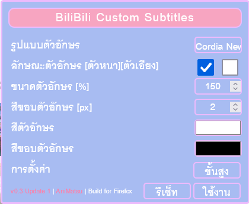
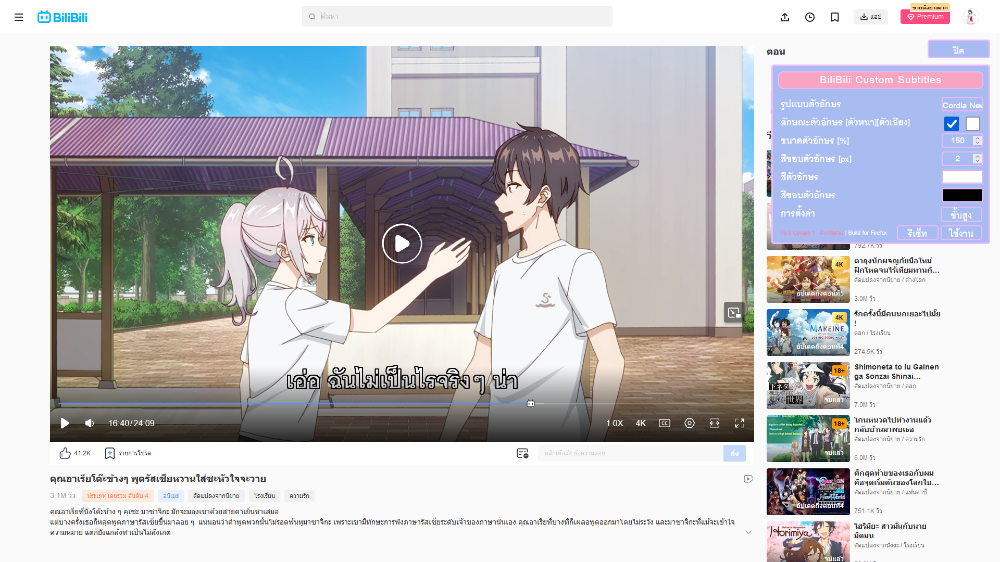
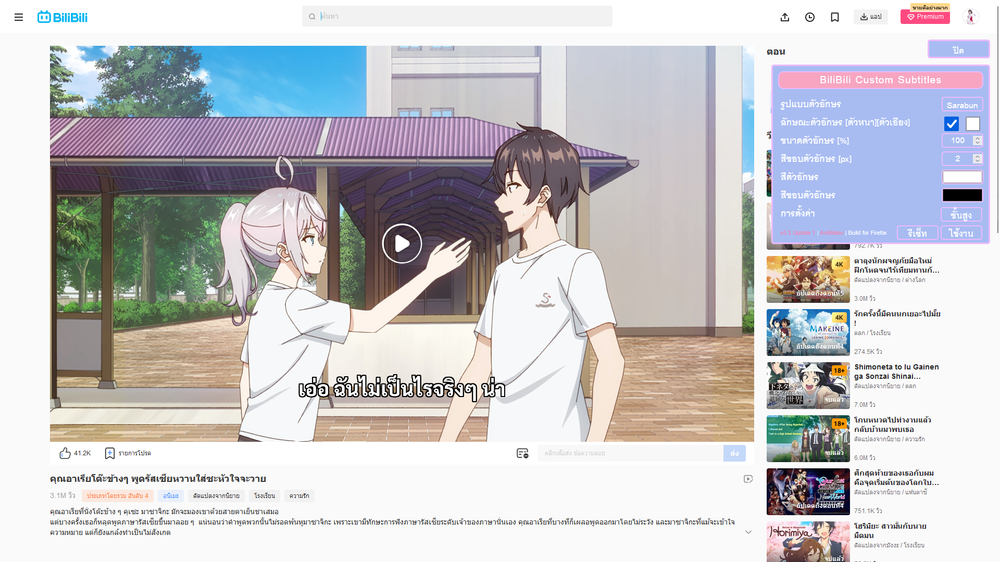
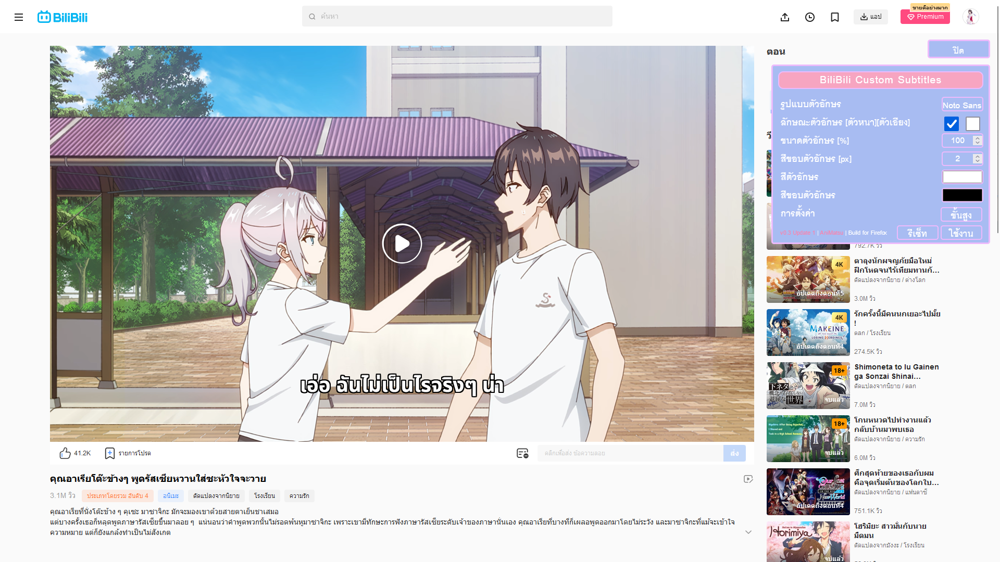

### Require

* **Tempermonkey Extension | [https://www.tampermonkey.net/](https://www.tampermonkey.net/)**

---

### Auto Installation

* **Greasy Fork | [BiliBili Custom Subtitles
  ](https://greasyfork.org/en/scripts/469229-bilibili-custom-subtitles)**

### Manual Installation

* **Open :** raw [bcs.js](https://raw.githubusercontent.com/AnimeAbout/BiliBili-Custom-Subtitles/main/bcs.js) and **Copy** all content in bcs.js
* **Open :** Tampermonkey Extension
* **Goto :** Dashboard
* **Click : +** Button and **Paste** replace all content
* **Save : Ctrl + s**

---

### NEW | Panel 0.3 Update1

---

### Preview

---

โค้ดค่อนข้างที่จะเละครับ ไว้มีเวลา จะมานั่งเขียนใหม่อยู่
